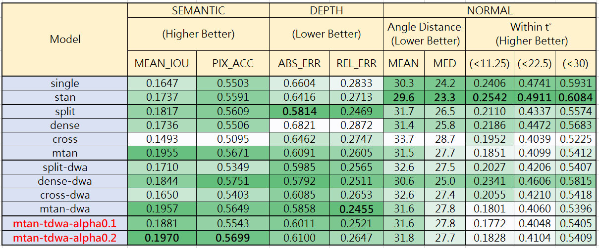

# Traced DWA

Start from DWA([Shikun Liu, etc.](https://arxiv.org/abs/1803.10704) 's proposal) [[code]](https://github.com/lorenmt/mtan), I propose a modified DWA, called **Traced DWA**, which considers the consistancy of lambda_k.


# Run

```
cd im2im_pred
python model_segnet_mtan-tdwa.py --gpus 0 --second_order_ratio 0.2 --weight 'tdwa'   --dataroot my_data_dir > "log/nyuv2-mtan-tdwa-r0.2.txt"
```


# Experiment Result

</img>

last update: 2020/06/10